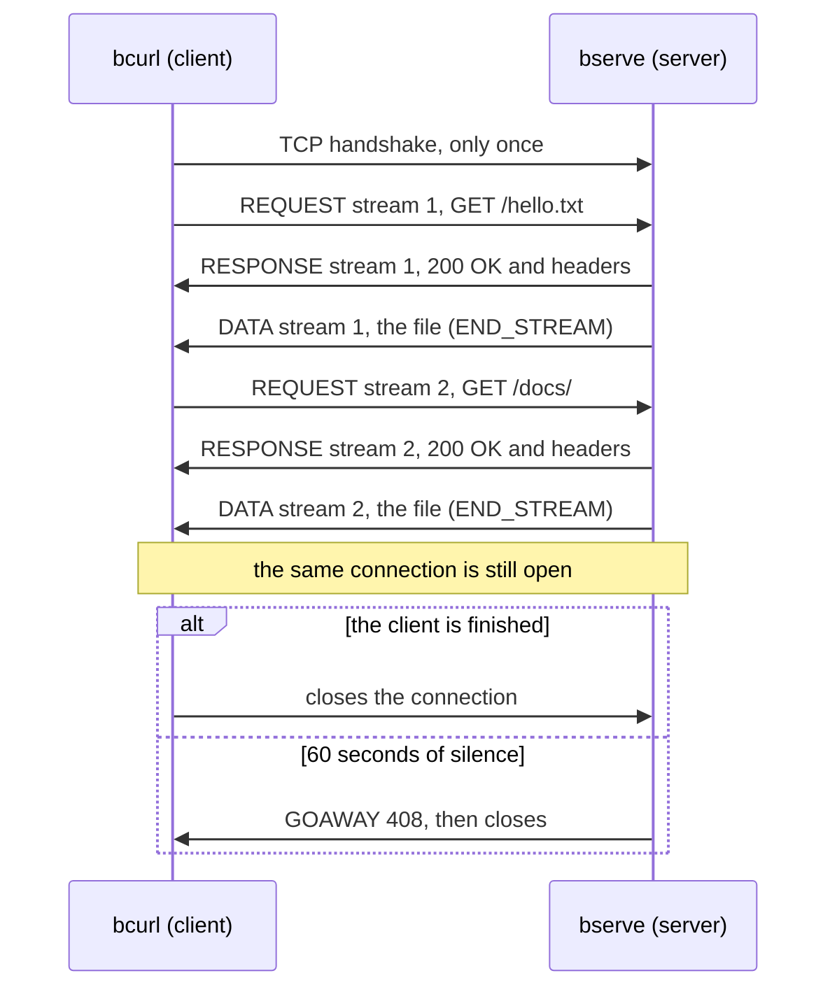
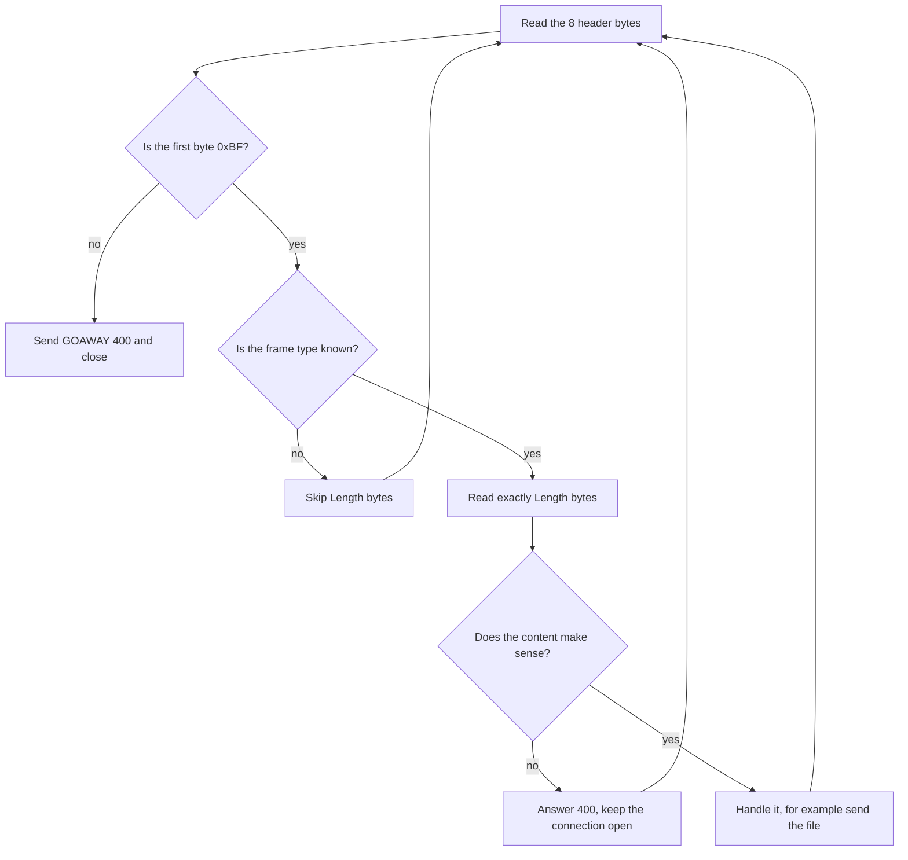

# HTTP in Binary (BHTTP/1)

**Student ID:** 23bcs10163
**Course:** Network Architecture, Course Project: HTTP in Binary

---

## The idea in one minute

Normal HTTP sends plain text, like `GET /index.html HTTP/1.1`. For this project I
designed a **binary** version of HTTP called **BHTTP/1** and built both halves of it:

* **`bserve`**, the server, which serves files from a folder;
* **`bcurl`**, the client, which asks for a file and prints it.

Every message is cut into **frames**. Every frame starts with the same small
**8-byte header**, which tells the receiver what the frame is and exactly how long it
is. That one simple rule gives three useful things:

1. **The connection can stay open.** The receiver always knows where a message ends,
   so nobody has to hang up to mark the end.
2. **Unknown frames can be skipped.** A program that sees a frame type it doesn't know
   can still read the length, jump over the frame and carry on. That is how a
   version 2 can add new things without breaking version 1.
3. **Mistakes are caught early.** Every frame starts with the same marker byte, `0xBF`.
   If the bytes ever get out of step, the very next frame shows it.

The rules are written down in the spec, [`spec/BHTTP-1.md`](spec/BHTTP-1.md). The server
and the client share nothing except those rules.

---

## Try it with one command

You need **Python 3.8 or newer**. There is nothing to install. On macOS or Linux, type
`python3` wherever this page says `python`.

```bash
python demo.py
```

The demo does five things:

1. It starts the server by itself.
2. It runs the client the way you would type it.
3. It checks the server against every rule in the spec.
4. It prints `PASS` or `FAIL` for each step.
5. It stops the server again.

This is what you'll see (the port number changes each time):

```text
Started bserve on port 60811, serving the www folder.

1. Fetch a file
   $ python bcurl 127.0.0.1:60811/index.html
   received index.html (262 bytes), exit code 0
   [PASS]

2. Look at the frames
   $ python bcurl -v 127.0.0.1:60811/hello.txt
   > REQUEST stream=1 flags=END_STREAM length=49  GET /hello.txt
   < RESPONSE stream=1 flags=- length=136  200 OK, 6 headers
   < DATA stream=1 flags=END_STREAM length=30
   body: Plain text, served by bserve.
   [PASS]

3. Ask for a file that is not there
   $ python bcurl 127.0.0.1:60811/missing.html
   404 Not Found: /missing.html is not here
   exit code 4 (non-zero, as the brief asks)
   [PASS]

4. Fetch two files over one connection
   $ python bcurl 127.0.0.1:60811/hello.txt 127.0.0.1:60811/docs/
   2 files received, the server saw 1 TCP connection
   [PASS]

5. Send a frame of unknown type first
   $ python bcurl --grease 127.0.0.1:60811/hello.txt
   server: skipped frame type 0xF2 (10 octets)
   and it still answered: Plain text, served by bserve.
   [PASS]

6. Check the server against every rule in the spec
   $ python tools/check_server.py 127.0.0.1:60811
   [PASS] GET an existing file gives 200                          spec 4
   [PASS] A missing file gives 404                                spec 4
   [PASS] Three requests share one connection                     spec 4
   [PASS] Requests sent all at once are answered in order         spec 4
   [PASS] A frame of unknown type is skipped                      spec 1
   [PASS] Unknown flag bits are ignored                           spec 1
   [PASS] An unknown header number is skipped                     spec 3
   [PASS] A literal header name is accepted                       spec 3
   [PASS] A malformed frame gives 400, connection stays open      spec 4
   [PASS] A request on stream 0 gives 400                         spec 4
   [PASS] HEAD gives headers and no body                          spec 4
   [PASS] POST gives 405 with an allow header                     spec 4
   [PASS] A path above the root gives 400                         spec 4
   [PASS] Bytes that are not a frame give GOAWAY 400, then close  spec 1, 4
   [PASS] 14 of 14 checks

Everything passed: 6 of 6 steps. bserve stopped.
```

---

## What is handed in

1. **The spec**, [`spec/BHTTP-1.md`](spec/BHTTP-1.md). It is about two pages, written so
   that a stranger could build a server or a client from it. It ends with **test bytes**: the
   exact bytes of a request, an answer, and a frame that must be skipped, so anyone can
   check their own code byte by byte.
2. **The program**: `bserve`, `bcurl`, and the code behind them in `app/`.
3. **An annotated hexdump** of one complete request and response,
   [`docs/annotated-hexdump.md`](docs/annotated-hexdump.md). Every byte is named and
   explained.

---

## Running it yourself

### 1. Start the server

```bash
python bserve ./www 9000
```

This serves the files in the `www` folder on port 9000. The brief writes the command as
`./bserve ./www 9000`, and that works on macOS and Linux too. On Windows you can also
type `.\bserve.cmd ./www 9000`.

```text
02:21:14 serving D:\network_architecture\www
02:21:14 bserve listening on port 9000
```

Keep this terminal open. Press **Ctrl + C** when you want to stop the server.

### 2. Use the client

Open a second terminal in the same folder:

```bash
python bcurl localhost:9000/index.html                        # fetch a file
python bcurl -v localhost:9000/index.html                     # ...and show every frame
python bcurl localhost:9000/missing.html                      # a missing file: exit code 4
python bcurl localhost:9000/hello.txt localhost:9000/docs/    # two files, one connection
python bcurl --annotate localhost:9000/hello.txt              # name every byte of every frame
```

To see the exit code after a command, type `echo $LASTEXITCODE` in PowerShell, or
`echo $?` in bash.

### 3. Check any server against the spec

```bash
python tools/check_server.py localhost:9000
```

This runs the same 14 checks you saw in step 6 of the demo. It talks to the server with
raw frames on fresh connections and uses none of bserve's server code, so it works on
**anyone's** BHTTP/1 server. A classmate can point it at their own server, and each failed check names the
rule in the spec that was broken. The brief says *"a client that only works against
your own server is an implementation, not a protocol"*. This tool is how you can tell
the difference.

### 4. Measure it

```bash
python tools/measure.py
```

This compares BHTTP/1 with plain HTTP/1.1 text and times the same requests three ways.
The results are explained under
[Why the frame header looks like this](#why-the-frame-header-looks-like-this).

### 5. Run the automatic tests

```bash
python -m unittest discover -s tests -t .
```

```text
....................................
----------------------------------------------------------------------
Ran 36 tests in 5.763s

OK
```

The tests start their own servers, so nothing needs to be running first. They cover:

* every frame type, and truncated or broken frames;
* big files split over many frames;
* one connection for many files;
* the spec's test bytes;
* the checker, the measurements and the demo.

---

## What it looks like

### Every frame with `-v`

The client prints the file to stdout, and the frames go to stderr, so both appear in the
terminal. Lines starting with `>` were sent, and lines starting with `<` were received.

```text
> python bcurl -v localhost:9000/hello.txt
* connected to ::1 port 9000 (the only connection this run opens)
> REQUEST stream=1 flags=END_STREAM length=48  GET /hello.txt
> 00000000  bf 01 01 00 01 00 00 30  01 00 0a 2f 68 65 6c 6c  |.......0.../hell|
> 00000010  6f 2e 74 78 74 01 00 0e  6c 6f 63 61 6c 68 6f 73  |o.txt...localhos|
> 00000020  74 3a 39 30 30 30 02 00  09 62 63 75 72 6c 2f 31  |t:9000...bcurl/1|
> 00000030  2e 30 03 00 03 2a 2f 2a                           |.0...*/*|
< RESPONSE stream=1 flags=- length=136  200 OK, 6 headers
< 00000000  bf 02 00 00 01 00 00 88  00 c8 04 00 0a 62 73 65  |.............bse|
< 00000010  72 76 65 2f 31 2e 30 05  00 1d 46 72 69 2c 20 32  |rve/1.0...Fri, 2|
< 00000020  35 20 53 65 70 20 32 30  32 36 20 32 30 3a 35 31  |5 Sep 2026 20:51|
< 00000030  3a 31 36 20 47 4d 54 06  00 19 74 65 78 74 2f 70  |:16 GMT...text/p|
< 00000040  6c 61 69 6e 3b 20 63 68  61 72 73 65 74 3d 75 74  |lain; charset=ut|
< 00000050  66 2d 38 07 00 02 33 30  08 00 1d 46 72 69 2c 20  |f-8...30...Fri, |
< 00000060  32 35 20 53 65 70 20 32  30 32 36 20 31 39 3a 34  |25 Sep 2026 19:4|
< 00000070  33 3a 34 37 20 47 4d 54  09 00 15 22 31 65 2d 31  |3:47 GMT..."1e-1|
< 00000080  38 64 38 61 37 64 65 64  39 33 30 39 32 33 63 22  |8d8a7ded930923c"|
* stream 1: 200 OK
< DATA stream=1 flags=END_STREAM length=30
< 00000000  bf 03 01 00 01 00 00 1e  50 6c 61 69 6e 20 74 65  |........Plain te|
< 00000010  78 74 2c 20 73 65 72 76  65 64 20 62 79 20 62 73  |xt, served by bs|
< 00000020  65 72 76 65 2e 0a                                 |erve..|
Plain text, served by bserve.
* 1 connection, 1 request(s), 1 response(s)
```

One frame went out, the request. Two came back: a RESPONSE with the status and headers,
then a DATA frame with the file. The last frame is marked `END_STREAM`, which means
"this answer is complete".

### The server terminal

```text
02:21:16 conn #4: TCP handshake from [::1]:63808
02:21:16 conn #4: stream 1 GET /hello.txt -> 200
02:21:16 conn #4: stream 2 GET /docs/ -> 200
02:21:16 conn #4: closed after 2 response(s): client closed the connection
```

Here one TCP handshake carried two requests, stream 1 and stream 2. The client kept to
one connection, just as the brief asks.

---

## How it works

### One connection, many requests



### Inside a frame

Every frame starts with these 8 bytes. The example is the first header from the `-v`
output above:

| Byte(s) | Example | Field | What it says |
| --- | --- | --- | --- |
| 1 | `bf` | Sync | Always `0xBF`. It marks the start of every frame. |
| 1 | `01` | Type | `01` REQUEST, `02` RESPONSE, `03` DATA, `04` GOAWAY |
| 1 | `01` | Flags | `01` means END_STREAM, the last frame of this message |
| 2 | `00 01` | Stream ID | which request this frame belongs to: 1, 2, 3 and so on |
| 3 | `00 00 30` | Length | how many bytes follow: here `0x30`, which is 48 |

### How the receiver reads a frame

This loop is the whole protocol from the receiver's side:



Notice that only a broken header closes the connection. A broken message *inside* a
frame gets a `400`, and the connection carries on. The length was fine, so the receiver
still knows exactly where the next frame starts.

### Small headers

The ten header names these programs actually send each get a number from 1 to 10:

* `host`, `user-agent`, `accept`
* `server`, `date`
* `content-type`, `content-length`, `last-modified`, `etag`
* `allow`

Sending the number costs **one byte** instead of the whole name. Any other name is
written out in full, with its length in front. These are the first two ideas of HPACK,
the header compression used by HTTP/2.

### What the server answers

| You ask for | The server answers |
| --- | --- |
| a file that exists | `200` and the file |
| a folder, like `/docs/` | that folder's `index.html` |
| a file that doesn't exist | `404` |
| a broken frame | `400`, and the connection stays open |
| a path that climbs out of the folder, like `/../secret` | `400` |
| anything other than GET or HEAD | `405` |
| a frame type it doesn't know | nothing: it skips the frame and waits for the next one |
| bytes that aren't BHTTP at all | `GOAWAY 400`, then it closes |

---

## Why the frame header looks like this

The brief asks: *HTTP/2 chose 24 / 8 / 8 / 31. Why?* HTTP/2's header holds length, type,
flags and stream, 9 bytes in total. It sends many files at the same time over one
connection, so it needs small frames and a huge number of stream IDs.

BHTTP/1 answers requests one after another, so it makes different choices:

| Field | BHTTP/1 | HTTP/2 | Why |
| --- | --- | --- | --- |
| Sync | 8 bits | none | Two different people write the server and the client. If either makes a framing mistake, this byte catches it right away instead of leaving the connection stuck. |
| Type | 8 bits | 8 bits | Room for 256 kinds of frame. That's plenty for later versions. |
| Flags | 8 bits | 8 bits | Eight on/off switches per frame. |
| Stream ID | 16 bits | 31 bits | Answers come back in order, so an ID only has to be unique among requests still waiting. 65,535 is far more than enough. |
| Length | 24 bits | 24 bits | Up to 16 MB per frame. A bigger file is simply sent as several DATA frames. |
| **Total** | **8 bytes** | 9 bytes | |

**The numbers back this up** (from `python tools/measure.py`):

```text
Size: the same messages as BHTTP/1 frames and as HTTP/1.1 text

  message                                   BHTTP/1  HTTP/1.1  smaller by
  request: GET /index.html, 3 headers          57 B      86 B         34%
  response head: 200, 6 headers               153 B     213 B         29%
  one header, not counting its value            3 B      18 B         84%
  frame header                                  8 B   (HTTP/2 uses 9 B)

Speed: 100 requests for /hello.txt on this computer (best of 3)

  how                                          time   TCP handshakes
  one connection, one request at a time       79 ms                1
  one connection, all requests at once        70 ms                1
  a new connection for every request         273 ms              100
```

Two things stand out:

* **The frames are smaller than text.** A request is about a third smaller, mostly
  because each header name costs 1 byte instead of its full name.
* **Keeping the connection open is much faster.** Opening a new connection for every
  request was about **3.5 times slower**. That's the cost of 100 TCP handshakes instead
  of one, and it's why the server keeps the connection open and the client never opens
  a second one.

Your times will be different on another computer, but the gap stays.

---

## Room for version 2

The brief has one rule you may not skip: *"a receiver meeting a frame type it does not
know MUST skip it cleanly."* BHTTP/1 goes further:

* **Unknown frame types** are skipped.
* **Unknown flag bits** are ignored.
* **Unknown header numbers** are skipped.

A version 2 can add new frames, flags and headers, and version 1 programs will keep
working.

You can check this yourself. With `--grease`, bserve or bcurl sends a frame of a type
that will never be used, and the other side has to skip it and still answer. The demo's
step 5 does exactly that.

---

## Commands and options

### `bserve`

```bash
python bserve ROOT [PORT] [options]
```

| Option | Default | What it does |
| --- | --- | --- |
| `ROOT` | (required) | the folder to serve, for example `./www` |
| `PORT` | `9000` | the port to listen on |
| `-v` | off | hexdump every frame in the server terminal |
| `--annotate` | off | with `-v`, name every field of every frame |
| `--grease` | off | send an unknown frame before every answer, to test clients |
| `--idle-timeout` | `60` | seconds a silent connection is kept open |
| `-q` | off | print less |

### `bcurl`

```bash
python bcurl [options] URL [URL ...]
```

A URL looks like `localhost:9000/index.html`. If you leave the port out, it is 9000.

| Option | What it does |
| --- | --- |
| `-v` | hexdump every frame |
| `--annotate` | name every field of every frame |
| `--dump-limit N` | with `-v`, show at most N bytes of each frame |
| `-I` | send HEAD: headers only, no body |
| `-X METHOD` | send another method: GET, HEAD, POST, PUT or DELETE |
| `-H 'name: value'` | add an extra header (you can repeat it) |
| `--pipeline` | send all the requests first, then read all the answers |
| `--grease` | send an unknown frame before each request, to test the server |

### `bcurl` exit codes

| Code | Meaning |
| --- | --- |
| `0` | every answer was OK |
| `2` | wrong command line, for example URLs for two different servers |
| `3` | protocol error: broken frames, a GOAWAY, or the connection closed too early |
| `4` | at least one answer was 4xx |
| `5` | at least one answer was 5xx |
| `7` | could not connect to the server |
